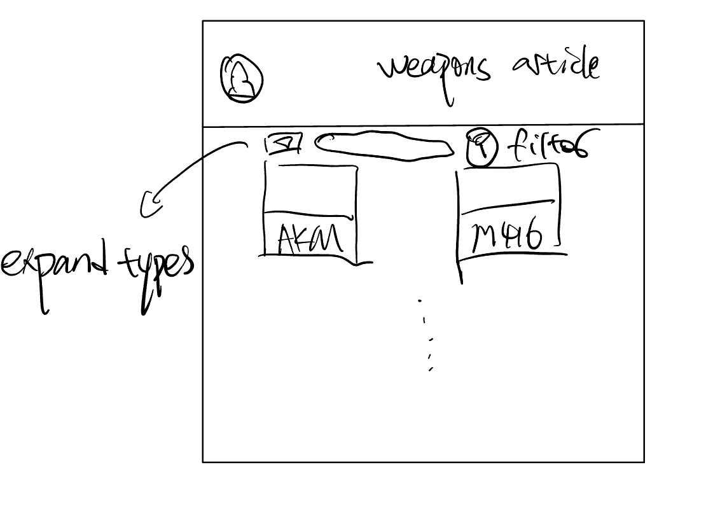
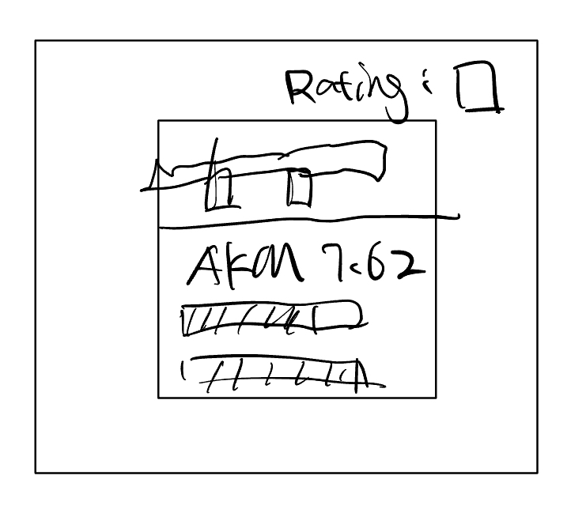
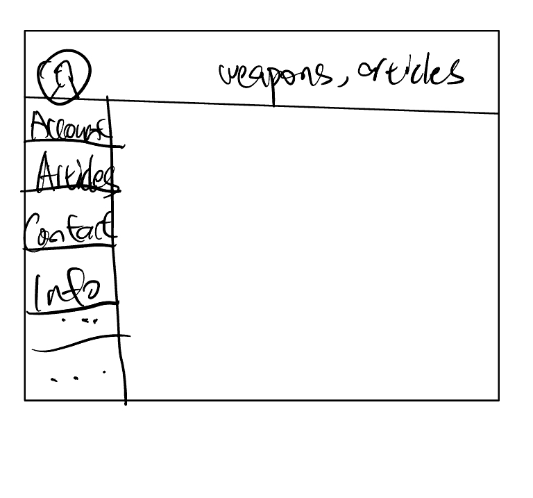

# PUBG Mobile Wiki and Strategies

## Overview

PUBG Mobile is a captivating free-to-play battle royale game developed by LightSpeed & Quantum Studio. This mobile adaptation draws its inspiration from the original PUBG (PlayerUnknown's Battlegrounds). In the game, players are airdropped onto a remote island and must strategize to be the last one standing. They can compete either as solo contenders, duos, or in squads based on the game mode they select. While an average match spans roughly 30 minutes, it precisely takes 32 minutes and 50 seconds for the safe zone to close in completely. Survivors caught outside the zone have an additional 11 seconds before succumbing, making the maximum game time approximately 33 minutes and 1 second for those adept at healing.

Owing to its widespread acclaim and competitive nature, PUBG Mobile has birthed professional esports competitions. The game's popularity has spurred an ever-growing player base, many of whom are keen on enhancing their gaming prowess. In response to this demand, our platform was conceived.

This website serves as both an information hub and a strategy resource. Users can delve into detailed descriptions and statistics of every item in PUBG Mobile, including an exhaustive weapon breakdown. Further, for those eager to improve their gameplay, our platform offers curated articles and video tutorials that provide invaluable insights, tips, and strategies. Some of the standout features of the site include a dedicated weapon tab, a user lookup tool where players can search and access profiles using player usernames, and a rich library of strategic content to help players climb the ranks and establish themselves as formidable contenders.

## Data Model

The application will store Users, Weapon Stats, Articles, etc

- users can have multiple articles and linkedAccounts to sync their match history and portfolios
- each weapon can have embedded articles and its corresponding statistics
- More Data Models ...

News:

```javascript
const NewsSchema = new mongoose.Schema({
  title: {
    type: String,
    required: true,
  },
  summary: {
    type: String,
    required: true,
  },
  content: {
    type: String,
    required: true,
  },
  author: {
    type: String,
    required: true,
  },
  publishedDate: {
    type: Date,
    default: Date.now,
  },
  updatedDate: {
    type: Date,
    default: null,
  },
  category: {
    type: String,
    required: true,
  },
  tags: [
    {
      type: String,
    },
  ],
  imageUrl: {
    type: String,
    default: null,
  },
  readMoreUrl: {
    type: String,
    default: null,
  },
});
```

Weapon Stats with embedded articles:

```javascript
{
  player: // a reference to a Player object,
  weapon: "AKM",
 	tag: ['rifle','7.62 Ammo']
  damage: "47",
  fireRate: "0.1s",
  strategyArticles: [
    { title: "Optimal Ranges for AKM", content: "The AKM is most effective at mid to long range combat...", views: "1234" },
    { title: "Recoil Control with AKM", content: "Managing recoil is crucial with AKM. Here's how you can...", views: "5678" },
  ],
  updatedAt: // timestamp
}

```

## [Link to Commented First Draft Schema](db.mjs)

## Wireframes

/weapons - page for all the weapons: with filtering functionality



/weapons/rifle/akm : displaying statistics for AKM, including its ratings, videos, and links to its related articles



/username: user profile



## User Stories or Use Cases

1. as non-registered user, I can view weapons wiki and see limited articles
2. as a user, I can log in to the site
3. as a user, I can create new articles
4. as a user, I can view all of the articles I have written and other peoples articles
5. as a user, I can link my accounts to other social medias
6. as a user, I can post experience in the forum (bonus functionality)

## Research Topics

- (5 points) Integrate user authentication
  - I'm going to be using passport for user authentication
  - And account has been made for testing; I'll email you the password
  - see <code>cs.nyu.edu/~jversoza/ait-final/register</code> for register page
  - see <code>cs.nyu.edu/~jversoza/ait-final/login</code> for login page
- (4 points) Perform client side mailing services using nodemail Library
  - if you put in a number that's greater than 5, an error message will appear in the dom
- (5 points) ReactJS
  - used ReactJS as the frontend framework, and I also incorporate the TypeScript to implement data type validations.

## [Link to Initial Main Project File](index.html)

index.html -- is the file where the browser render the application

./frontend/src/App.jsx -- is the file where the content I have to modify

## Annotations / References Used

This project incorporates a variety of technologies and external resources. The following are key references used, along with links to specific parts of the source code influenced by these resources:

1. **Passport.js Authentication**: The Passport.js documentation was crucial for implementing our authentication system. It provided guidance on using strategies and middleware for user authentication.

   - [Passport.js Authentication Docs](http://passportjs.org/docs) 

2. **ReactJS Development**: ReactJS was instrumental in building our frontend. We relied on official tutorials for best practices in creating reactive UI components.

   - [ReactJS Tutorials](https://react.dev/learn) 

3. **EmailJS Integration**: EmailJS was used for handling email operations within the application. We followed their documentation to integrate email services seamlessly.

   - [EmailJS Documentation](https://www.emailjs.com/docs/) 

4. **Connect Flash for Messaging**: Connect Flash was utilized for flash messaging in the application, aiding in displaying success or error messages to the user.

   - [Connect Flash Documentation](https://github.com/jaredhanson/connect-flash) 

5. **Bcrypt for Password Hashing**: We used Bcrypt for secure password hashing. This was essential for maintaining user password security in our application.
   - [Bcrypt Documentation](https://github.com/kelektiv/node.bcrypt.js) 
